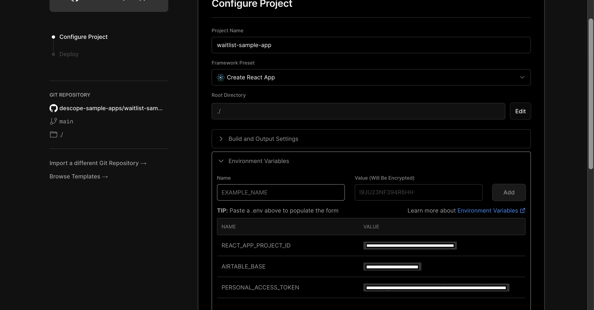

# waitlist-sample-app

We will be implementing a Waitlist app with Descope Flows and Airtable. By the end of the tutorial, you will have a web app that will allow users to sign up/login through the waitlist form with a Profile page. 

To start, please setup your Airtable and deploy to Vercel! Instructions below! 👇

## Setting up Airtable ⚙️

First, let’s set up our Airtable. 
1. Create an account in Airtable. 
2. Create a base with the fields: Email (Email), and Approved (Checkbox). Rename the table to “Registration.” 

<br />


Fig: airtable base with Email and Approved columns 

<br />

3. Create a Personal access token to authenticate API requests. Click on your account profile → Developer Hub → Create Personal access token with the following settings.

<br />


Fig: personal access token creation 

<br />

4. Once the token is created, save it somewhere securely because we will need it for later. 
5. We will need to use Airtable’s web API. To get familiar make sure to check out the Airtable web api documentation. In the API reference, select the Waitlist Base that we created. The API reference will also show you your Airtable base (highlighted in the image below). Be sure to copy that base somewhere because we will be using that when we deploy to Vercel. 

<br />


Fig: Airtable base is highlighted in the curl

<br />

When we deploy to Vercel we will need our Personal access token and the Airtable base id. 
Now let’s set up our Descope Project. 

## Deploy to Vercel 🚀

1. Create an account in [Vercel](https://vercel.com/) and create a new Team.
2. Create a new Project and import your GitHub Repository
3. Set your environment variables: ```REACT_APP_PROJECT_ID```, ```AIRTABLE_BASE```, and ```PERSONAL_ACCESS_TOKEN```. To clarify, the ```REACT_APP_PROJECT_ID``` is your Descope project ID. 

<br />


Fig: Vercel deployment

<br />

When you deploy to Vercel, there will be errors because we did not create our Descope flow yet. Let’s leave this aside for now and build out our APIs!

<br />

### Happy Coding ☕ 


