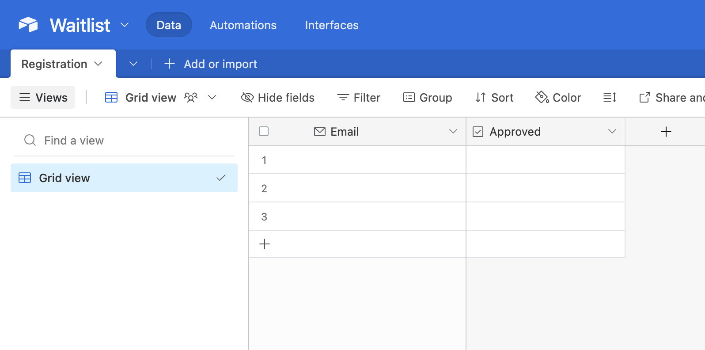
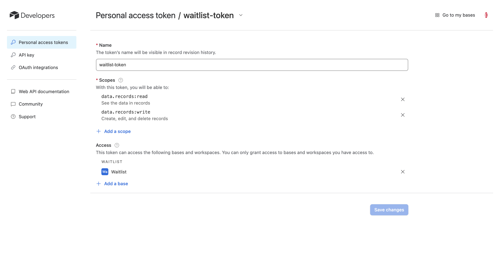
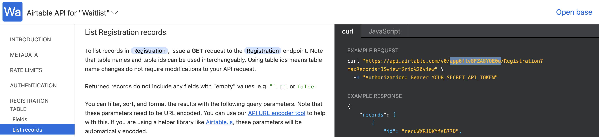

# A Better Waitlist

Implement a Waitlist app with Descope Flows and Airtable. 

## 📝 Table of Contents 

1. [Features](#-features)
2. [Installation](#-installation)
3. [Setting up Airtable](#-setting-up-airtable)
4. [Deploy](#-deploy-to-vercel)

## ✨ Features

- Custom Waitlist form
- Descope email verification and authentication
- Airtable for waitlist 
- Email notifications and a custom profile page

## ⚙️ Installation

1. Clone the repository:

```
git clone https://github.com/descope-sample-apps/waitlist-sample-app.git
```

2. Install dependencies:

```
npm install
```

3. Setup environment variables:

```
REACT_APP_PROJECT_ID="YOUR_DESCOPE_PROJECT_ID"
AIRTABLE_BASE="YOUR_AIRTABLE_BASE"
PERSONAL_ACCESS_TOKEN="YOUR_AIRTABLE_PERSONAL_ACCESS_TOKEN"
```
- ```REACT_APP_PROJECT_ID```: is your Descope Project ID and can be found in your Descope's account under the [Project page](https://app.descope.com/settings/project).
- ```AIRTABLE_BASE```: can be found in the your Airtable base. Learn more [here](https://support.google.com/appsheet/answer/10106767).
- ```PERSONAL_ACCESS_TOKEN```: you can create and personal access in Airtable [here](https://airtable.com/create/tokens).

## 📦 Setting up Airtable

First, let’s set up our Airtable. 

1. Create an account in Airtable. 
2. Create a base with the fields: Email (Email), and Approved (Checkbox). Rename the table to “Registration.” 

<br />

 

<br />

3. Create a Personal access token to authenticate API requests. Click on your account profile → Developer Hub → Create Personal access token with the following settings.

<br />



<br />

4. Once the token is created, save it somewhere securely because we will need it for later. 
5. We will need to use Airtable’s web API. To get familiar make sure to check out the Airtable web api documentation. In the API reference, select the Waitlist Base that we created. The API reference will also show you your Airtable base (highlighted in the image below). Be sure to copy that base somewhere because we will be using that when we deploy to Vercel. 

<br />



<br />

When we deploy to Vercel we will need our Personal access token and the Airtable base id. 
Now let’s set up our Descope Project. 

## 🚀 Deploy to Vercel 

[](https://vercel.com/new/clone?repository-url=https%3A%2F%2Fgithub.com%2Fdescope-sample-apps%2Fwaitlist-sample-app&env=REACT_APP_PROJECT_ID,AIRTABLE_BASE,PERSONAL_ACCESS_TOKEN)

> **_NOTE:_** When you deploy to Vercel, there will be errors because we did not create our Descope flow yet. Learn more about how we build the flow in the [blog](https://www.descope.com/blog/post/waitlist-app-airtable).

## ⚠️ Issue Reporting

For any issues or suggestions, feel free to open an issue in the GitHub repository.

## 📜 License

This project is licensed under the MIT License - see the [LICENSE](LICENSE) file for details.


